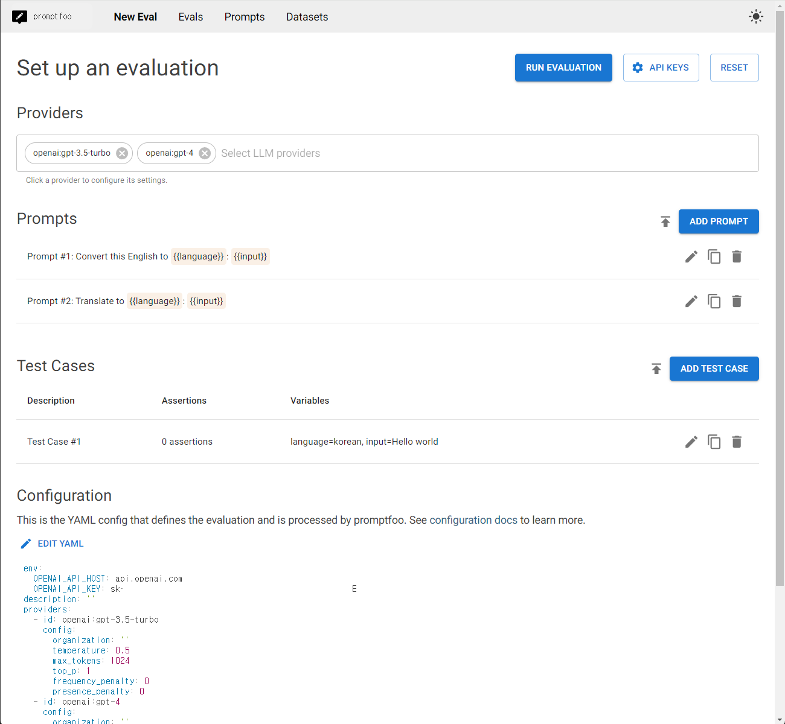

### <font color="#FF5733">Windows 버전 구축</font>

본 저장소는 [promptfoo](https://github.com/promptfoo/promptfoo)의 소스 코드를 Windows 환경에서, 개인의 AI 연구를 목적으로 구축하여, 사용할 목적으로 제작되었습니다.<br/>
본 저장소는 어디까지나 개인에 [학습/연구] 용으로 [운영/관리] 하기에, 개인의 사정으로 삭제되거나, 작업이 지연될 수 있음을 인지하셔야 합니다.<br/>
원조 저작자의 [라이센스](./LICENSE)를 상세하게 살펴본 후, 본 저작물을 인용 시, 관련 출판물에 적용할 <font color="#FF5733">요구사항</font>을 숙지하셔야 합니다.

#### 저에게 연락
Windows 버전에 문의가 있으신 분은 <a href="mailto:osoi@naver.com">이메일</a>을 이용해 주세요.


----------------------------------

# promptfoo

본 문서는 개발자 입장에서, 소스를 직접 <font color="#FF5733">빌드/실행</font>에 대한 것을 다룹니다.<br/>
원조 저작물은 `linux` 환경으로 설정되어, `windows` 환경에 맞추어 코드를 수정하였습니다.


## Windows 개발자용

다음은 promptfoo 베타 버전을 [수정/개발/확장]하려는 사람들을 위해, 소스 코드를 직접 실행하기 위한 가이드 입니다.<br/>
windows 환경에서 개발할 것이 아니라면, 원조 저작자의 [저장소](https://github.com/promptfoo/promptfoo)를 자신의 GitHub로 [Fork](https://github.com/promptfoo/promptfoo/fork)하여, 사용하시길 바랍니다.


## 설치 요구 사항

(1) [NodeJS/NextJS] 환경변수들을 설정하고, 종속성과 이전 빌드 결과물들을 제거한다.
```
- 환경변수들 설정
  > SETX NODE_ENV "development"
  > SETX NEXT_PUBLIC_SUPABASE_URL "http://"
  > SETX NEXT_PUBLIC_SUPABASE_ANON_KEY "abc"
  > SETX NEXT_PUBLIC_PROMPTFOO_BUILD_STANDALONE_SERVER "1"

- 종속성과 이전 빌드 결과물들을 제거
  > npm run install:clean
```

(2) 종속성 설치
```
> cd ./promptfoo
> npm i
```

만약, 아래의 오류가 발생한다면, 명령들을 수행시킨다.
```
- 오류 발생
  - info Creating an optimized production build .잘못된 경로
  0개 파일이 복사되었습니다.
  npm ERR! code 4
  npm ERR! path E:\Study\Rust\repos\AI\3.Prompter\Tools\promptfoo
  npm ERR! command failed
  npm ERR! command C:\windows\system32\cmd.exe /d /s /c npm run install:nextui && npm run build:clean && npm run build

- 수행 명령
  > npm run db:generate
  > npm run db:migrate
  > npm run build:nextui
```


## 개발 모드 실행

(1) 서버를 실행시킨다.
```
> npm run local:web
```

(2) 브라우저로 접속한다.
```
> http://localhost:3000
```
접속 포트는 시스템에 따라 변경될 수 있으니, 콘솔창에 출력된 포트로 접속하세요.

(3) 브라우저에서, OpenAI [API KEYS] 설정하기
```
> OpenAI API key
  https://platform.openai.com/api-keys 에서, 유료 회원으로 가입하여, 직접 생성시켜야 한다.
> OpenAI API host
  api.openai.com
> OpenAI organization
  [API key] 생성 시, 조직을 의미한다.
  [Personal]로 생성시켰다면, 아무 것도 입력하지 않아야 한다.
```
정상적으로 설정한 후, [RUN EVALUATION]을 클릭하면, [Evals] 화면으로 이동되며, 평가 결과를 보여줍니다.<br/>


(4) 오류 처리
```
1. 아래의 오류가 발생하면, [Personal] 조직명을 삭제한다.
  - 오류 메세지
    Unhandled Runtime Error
    Error: HTTP error! status: 404
  - 해결 방법
    > 상단 메뉴 : [API KEYS]를 선택하고, 위 (3)항의 작업을 재시도 해본다.
      이전의 설정값이 제대로 적용되지 않은 경우가 있다.

2. 아래의 오류가 발생하면, [Personal] 조직명을 삭제한다.
  - 오류 메세지
    API error: No such organization: Personal., Type: invalid_request_error, Code: invalid_organization
  - 해결 방법
    > 상단 메뉴 : API KEYS > OpenAI organization > 비입력(삭제) 처리
```


## 배포판 만들기
```
- 환경변수 확인/변경
  > echo %NODE_ENV%
  > SETX NODE_ENV "production"
  ... 작업 미정
```


# 라이센스

포함된 [라이센스](./LICENSE) 파일에 내용을 숙지하세요.
